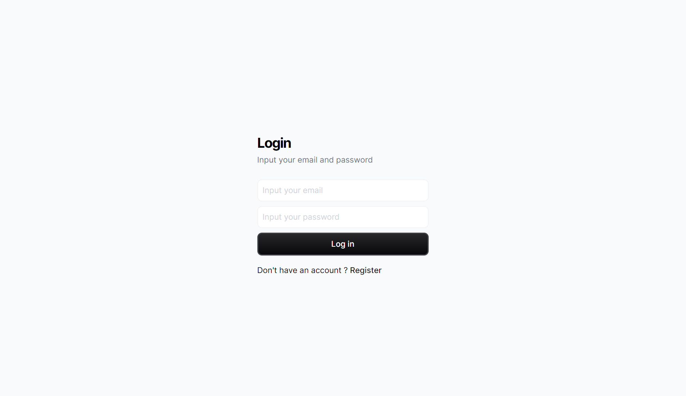

# BETH Stack Template

This is a template for a BETH stack project. It is a simple web application that uses the following technologies:

- [B]un.js
- [E]lysia
- [T]urso Database
- [H]TMX

Other technologies used:

- Typescripts
- Drizzle
- Tailwind CSS
- Kitajs
- Lucia Auth

## Getting Started



To get started, clone this repository and run `bun install` to install the dependencies. Then, run `bun start` to start the development server.

## Database

The database is a Turso database. It is sqlite on Edge. The database schema is located in the `models/db/` folder `schema.ts`.

### Migrations

To create a migration, run :

```bash
bun db:generate
```

This will create a migration file in the `models/db/migrations` folder.
To run the migrations, run :

```bash
bun db:migrate
```

## What's next ?

- [x] Lucia Oauth Github and Google ✅
- [ ] Basic Components
- [ ] Documentations
- [ ] Dockerfile
